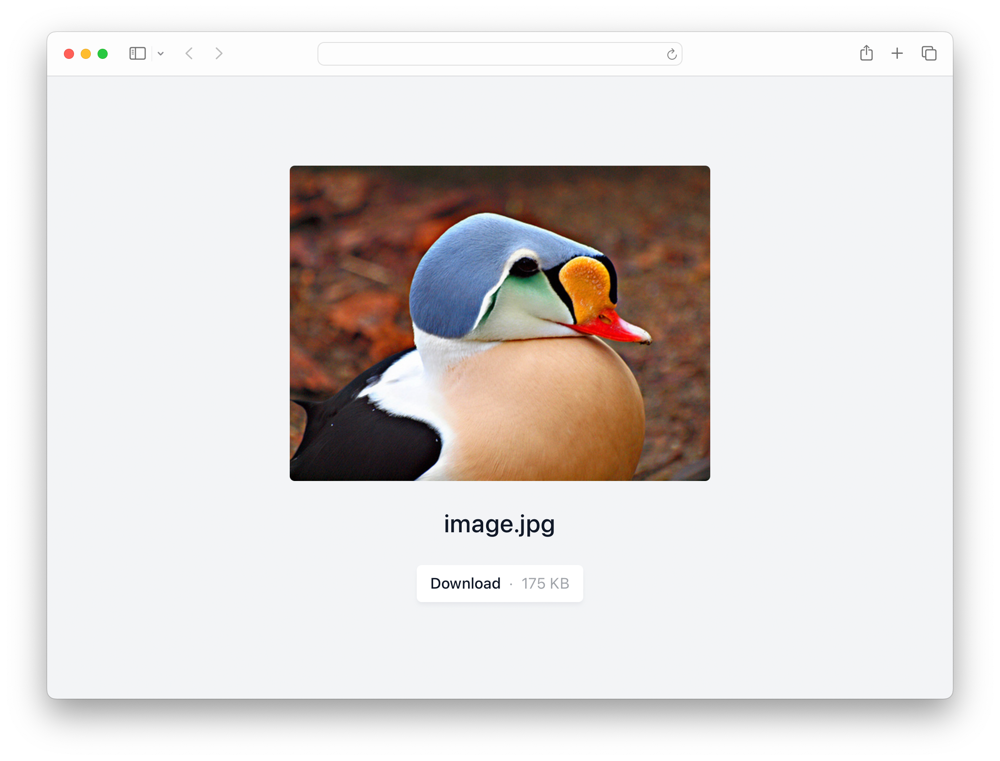
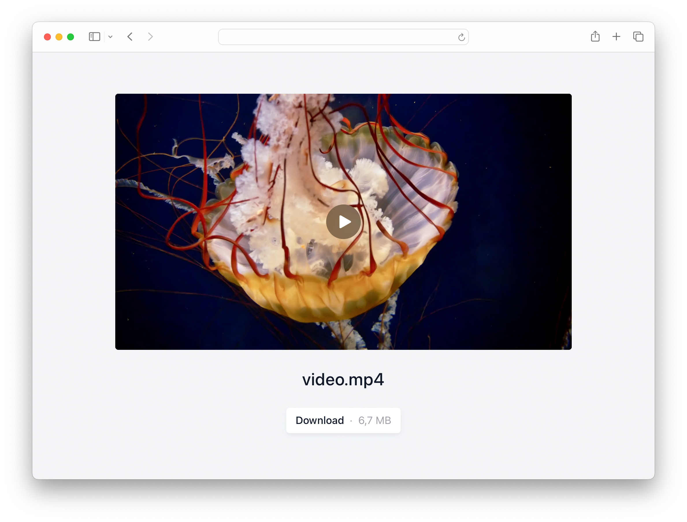
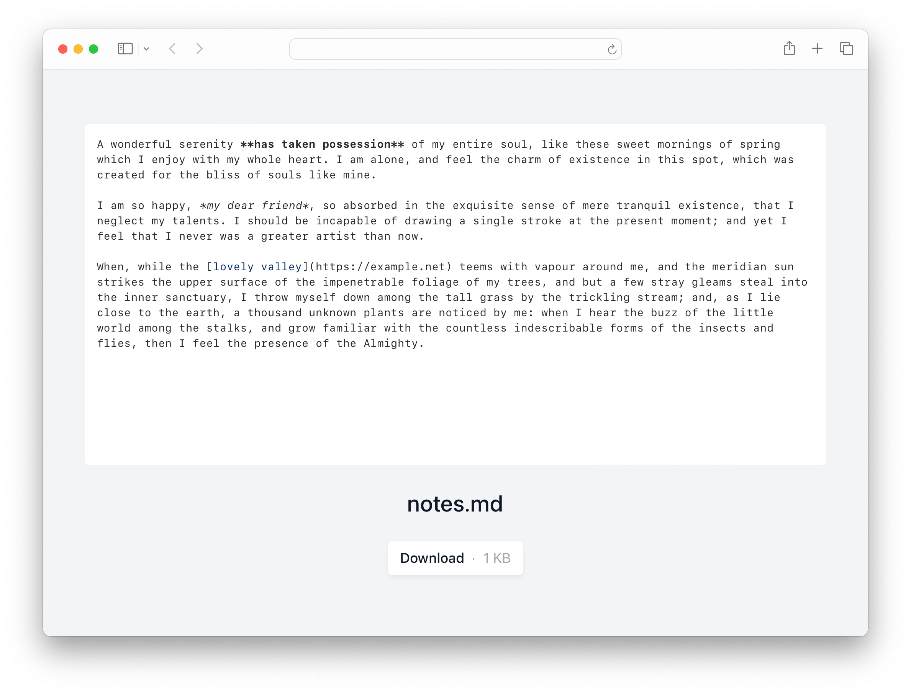
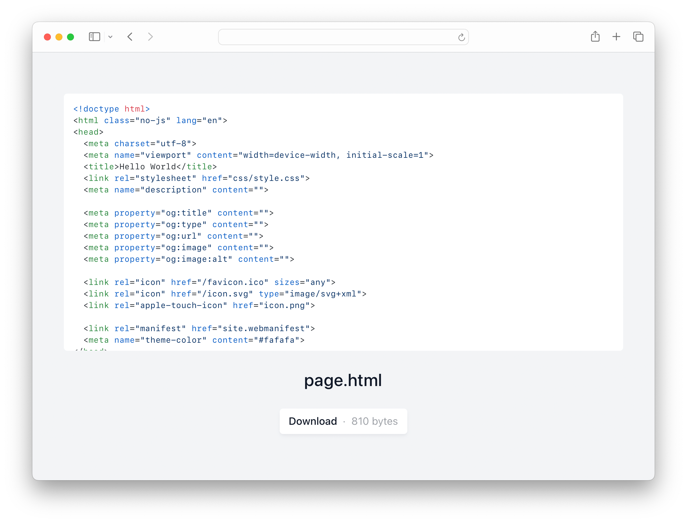
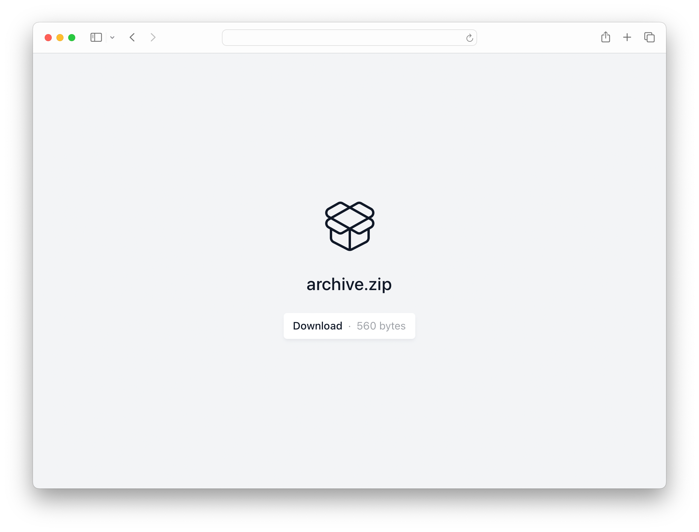
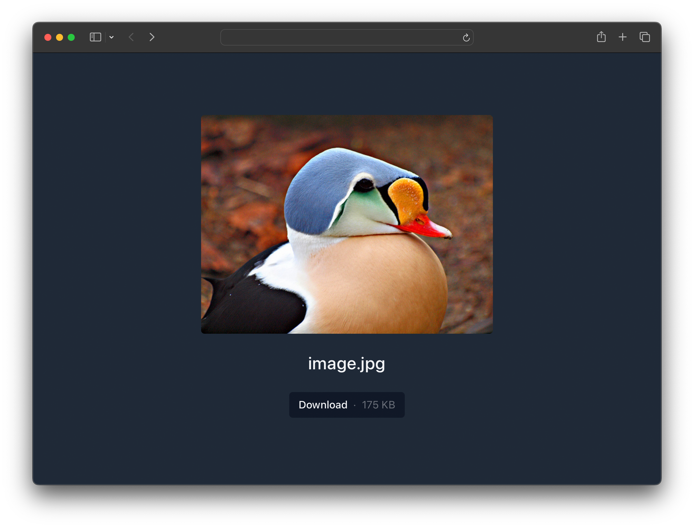
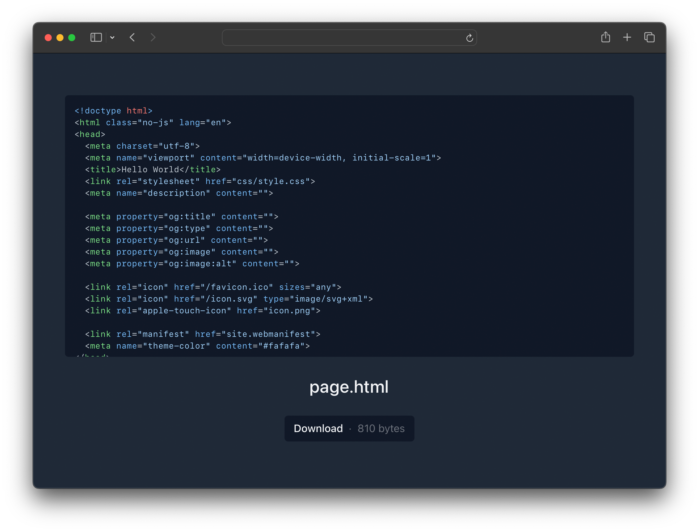
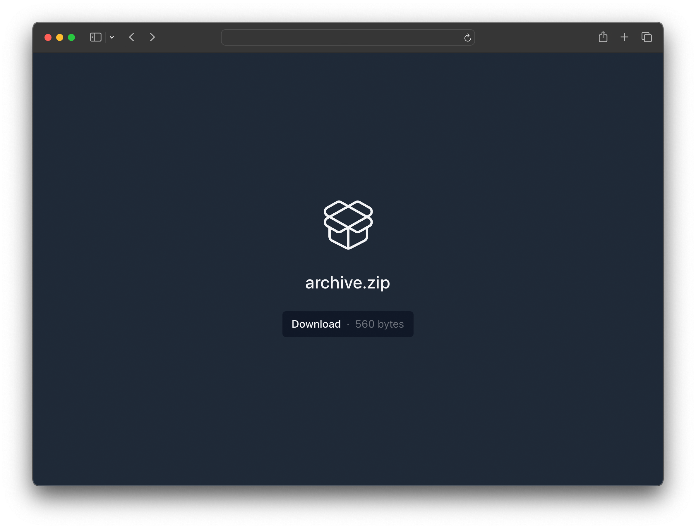
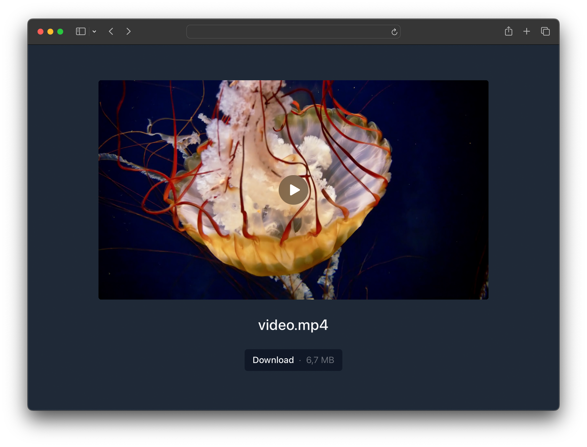
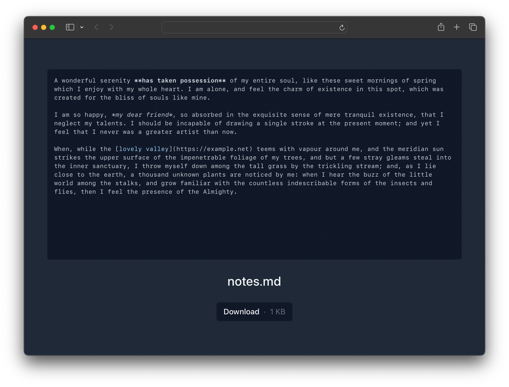

# Dropshare Landing Page

An unobtrusive landing page template for the Mac filesharing app [Dropshare](https://getdropsha.re).

## Features

* Minimal design in dark and light mode
* Media previews for images, videos and text files
* Syntax highlighting for common code files
* Generic file icon for other file types

## Screenshots

### Images

### Videos

### Text & Notes

### Code

### Other files

### Dark Mode

## Dark/Light Mode

Light             |  Dark
:-------------------------:|:-------------------------:
 | 
 | 
 | 
 | 
 | 
